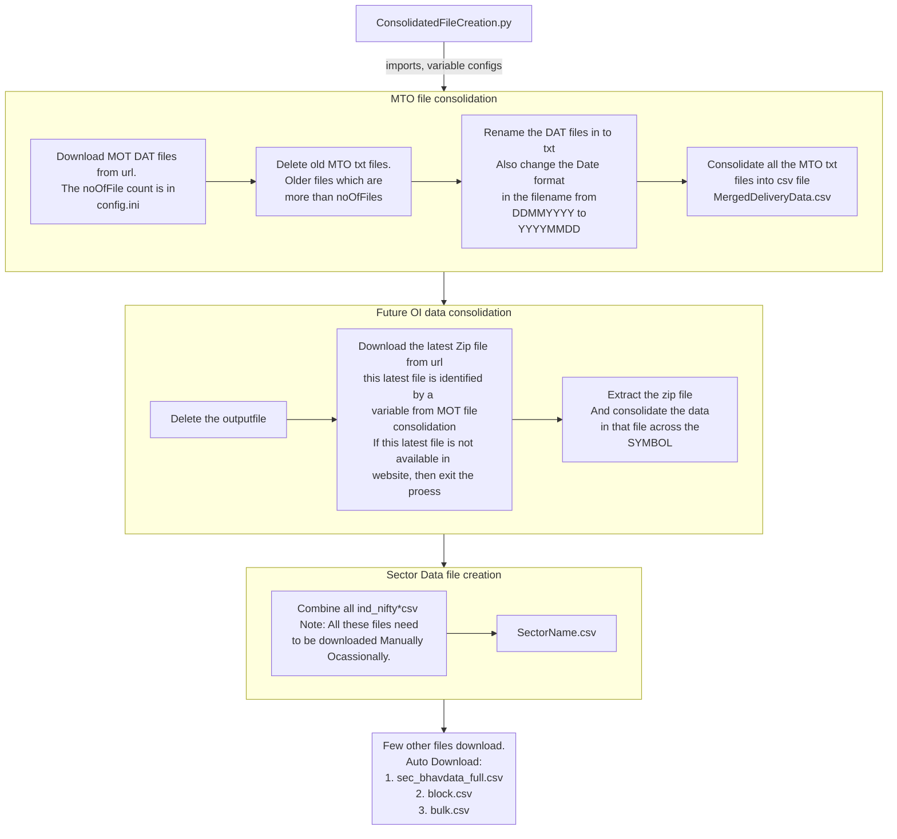
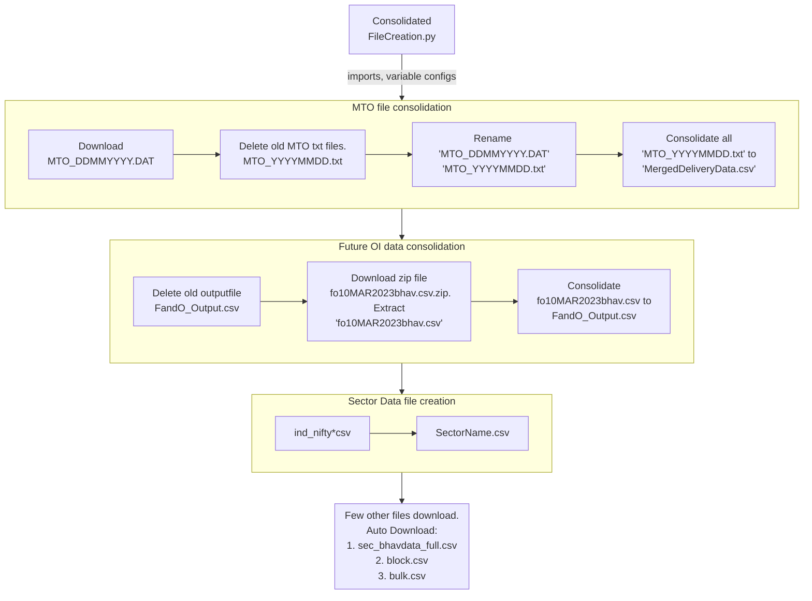
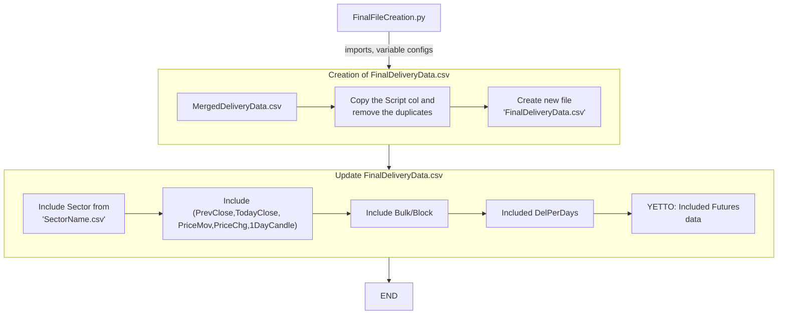

# Datapoint
Recreating the Java codes in Python

# Content:
- Detail Flow of [ConsolidatedFileCreation.py](README.md#detailed-flow-of-consolidatedfilecreationpy-)
- Short version of [ConsolidatedFileCreation.py](/README.md#short-flow-chart-)
- Flow of [FinalFileCreation.py](/README.md#flow-of-finalfilecreationpy-)

## Detailed Flow of ConsolidatedFileCreation.py:   

## Short Flow chart:  

## Flow of FinalFileCreation.py:  

